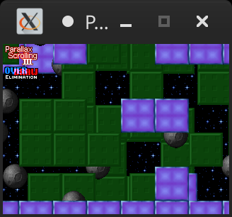

## Olofson

SDL2 demos using the SDLAda binding.

## Requirements

* Ada 2012 compiler
* GPRbuild
* [SDLAda](https://github.com/Lucretia/sdlada)

## Build

```sh
gprbuild parallax3.gpr -XSDL_PLATFORM=macosx
gprbuild parallax4.gpr -XSDL_PLATFORM=macosx
gprbuild ballfield.gpr -XSDL_PLATFORM=macosx
gprbuild fixedratepig.gpr -XSDL_PLATFORM=macosx
```

## Screenshots



## Original

The originals are found [here](http://olofson.net/examples.html).
